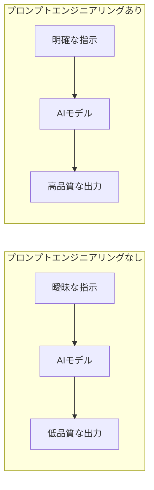
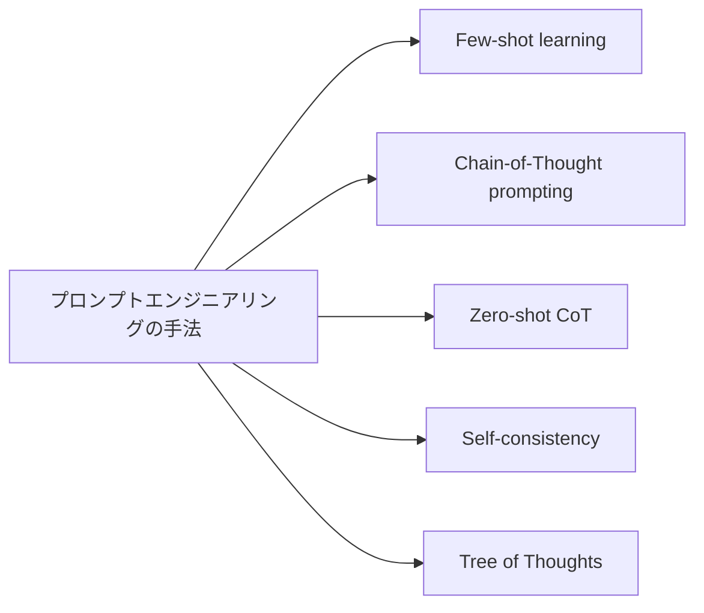
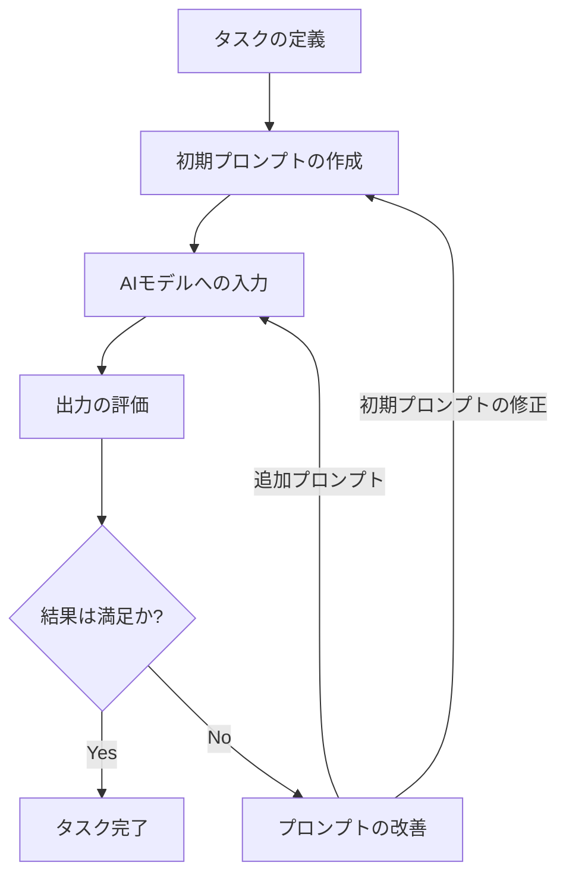
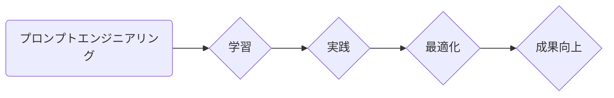
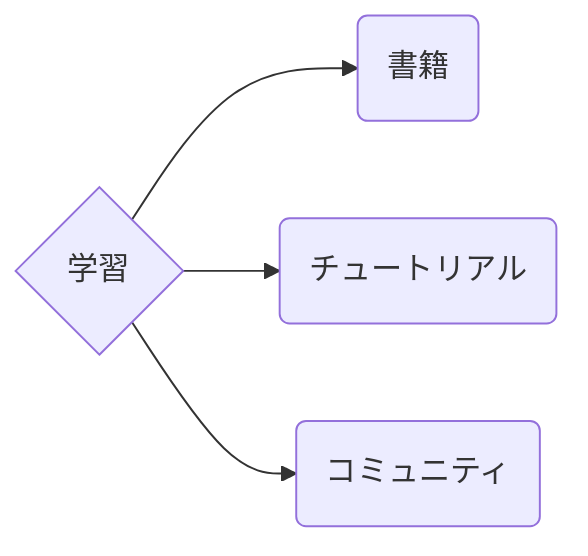
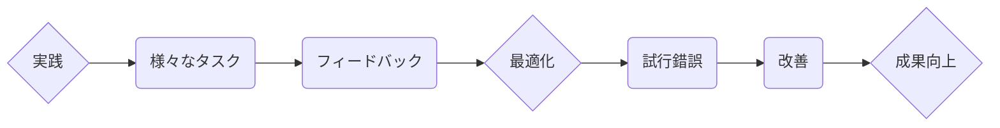

# doc_genai_About_prompt_engineering
プロンプトエンジニアリングについて

## プロンプトエンジニアリングについて

## 目次
- [1. プロンプトエンジニアリングとは？](#1-プロンプトエンジニアリングとは)
- [2. なぜプロンプトエンジニアリングが重要なのか？](#2-なぜプロンプトエンジニアリングが重要なのか)
- [3. コーディングタスクにおけるプロンプトエンジニアリング](#3-コーディングタスクにおけるプロンプトエンジニアリング)
  - [3.1 具体的な例：Pythonで素数判定関数を作成する](#31-具体的な例pythonで素数判定関数を作成する)
- [4. プロンプトエンジニアリングの手法](#4-プロンプトエンジニアリングの手法)
- [5. プロンプトエンジニアリングのプロセス](#5-プロンプトエンジニアリングのプロセス)
- [6. まとめ](#6-まとめ)


### 1. プロンプトエンジニアリングとは？

近年のAI技術の進化により、人間と自然言語で対話できるAIモデルが登場しました。中でも、テキスト生成AIは、文章作成、翻訳、プログラムコード生成など、様々なタスクを自動化できる可能性を秘めています。

しかし、AIモデルは万能ではありません。その出力の質は、与えられた指示、つまり「プロンプト」の質に大きく左右されます。プロンプトエンジニアリングとは、AIモデルに対して効果的な指示を設計し、より望ましい出力を得るための技術です。 


<br/><br/>

### 2. なぜプロンプトエンジニアリングが重要なのか？

AIモデルは、膨大なデータからパターンを学習し、そのパターンに基づいて出力を生成します。しかし、モデル自身が「何を求められているか」「どのようなアウトプットが最適か」を理解することはできません。

そこで、プロンプトエンジニアリングが必要となります。プロンプトを工夫することで、AIモデルの潜在能力を引き出し、より具体的で正確、そして創造的なアウトプットを得ることが可能になります。



<br/><br/>

### 3. コーディングタスクにおけるプロンプトエンジニアリング

プロンプトエンジニアリングは、特にコーディングタスクにおいてその効果を発揮します。例えば、以下のような効果が期待できます。

* **コード生成の効率化:** 複雑なコードや特定の機能を持つ関数を、プロンプトを通じて効率的に生成できます。
* **コード品質の向上:** 型チェック、エラー処理、コメントの追加などを指示することで、より高品質で保守性の高いコードを生成できます。
* **学習コストの削減:** 新しいプログラミング言語やライブラリを使用する際に、詳細な文法を学習する前に、プロンプトを通じて基本的なコードを生成し、学習を効率化できます。


<br/><br/>

#### 3.1 具体的な例：Pythonで素数判定関数を作成する

**プロンプトなしの場合:**

```python
Pythonで素数を判定する関数を作成してください。
```

この場合、AIモデルは以下のような一般的な素数判定関数を出力するでしょう。

```python
def is_prime(n):
  """素数かどうか判定する関数

  Args:
    n (int): 整数

  Returns:
    bool: 素数であればTrue、そうでなければFalse
  """
  if n <= 1:
    return False
  for i in range(2, int(n ** 0.5) + 1):
    if n % i == 0:
      return False
  return True
```

**プロンプトありの場合:**

```
Pythonで素数を判定する関数を作成してください。以下の条件を満たすようにしてください：
1. 関数名は `is_prime` とする
2. 引数は整数値1つとする
3. 効率的なアルゴリズムを使用する (sqrt(n) までの試し割りで十分です)
4. 2未満の入力値に対しては `ValueError` を発生させる
5. ドキュメンテーション文字列を追加し、関数の仕様、引数、戻り値、例外処理について記述する
6. 整数以外の入力値に対しては `TypeError` を発生させる
7. コードにはコメントを付け、各ステップを説明する
8. 関数の使用例も示す
```

このプロンプトでは、関数の仕様、効率性、エラー処理、ドキュメント、コードのコメント、使用例など、具体的な要件を指定しています。その結果、AIモデルはより高品質で理解しやすいコードを生成する可能性が高まります。

```python
def is_prime(n):
  """
  与えられた数が素数かどうかを判定します。

  Args:
      n: 判定する整数値

  Returns:
      素数の場合 True、そうでない場合 False

  Raises:
      TypeError: n が整数でない場合
      ValueError: n が 2 未満の場合
  """
  # 入力値の型チェック
  if not isinstance(n, int):
    raise TypeError("入力値は整数である必要があります。")
  
  # 2未満の値は素数ではない
  if n < 2:
    raise ValueError("入力値は2以上である必要があります。")
  
  # 2は素数
  if n == 2:
    return True
  
  # 偶数は素数ではない
  if n % 2 == 0:
    return False
  
  # 3からsqrt(n)までの奇数で割り切れるかどうか調べる
  for i in range(3, int(n**0.5) + 1, 2):
    if n % i == 0:
      return False
  
  # どの奇数でも割り切れなかった場合は素数
  return True

# 使用例
print(is_prime(7))  # True
print(is_prime(10)) # False
print(is_prime(1))  # ValueError: 入力値は2以上である必要があります。
```

### 4. プロンプトエンジニアリングの手法

効果的なプロンプトを作成するために、様々な手法が提案されています。

* **Few-shot learning:** 少数の入力と出力のペアを例として提示することで、AIモデルにタスクの構造を学習させる
* **Chain-of-Thought (CoT) prompting:** 思考過程を明示的に示すことで、AIモデルの推論能力を向上させる
* **Zero-shot CoT:** Few-shot learningと同様に思考過程を明示的に示すが、例を提示せずにプロンプトのみでAIモデルに推論を促す
* **Self-consistency:** 同じプロンプトに対して複数の出力を生成させ、その中で最も確からしいものを選択する
* **Tree of Thoughts (ToT):** 問題を部分問題に分解し、それぞれの部分問題に対する解を組み合わせて最終的な解を導く

これらの手法は、タスクの性質やAIモデルの特性に合わせて選択・組み合わせる必要があります。



<br/><br/>

### 5. プロンプトエンジニアリングのプロセス

プロンプトエンジニアリングは、一度のプロンプト作成で完了するものではなく、試行錯誤を繰り返しながら最適なプロンプトを見つけ出すプロセスです。


1. **タスクの定義:** AIに何をさせたいかを具体的に決めます。
2. **初期プロンプトの作成:**  定義したタスクに基づき、AIへの指示を記述します。
3. **AIモデルへの入力:** 作成したプロンプトをAIに入力します。
4. **出力の評価:** AIの出力結果が期待通りか評価します。
5. **結果が満足いくものでない場合:** 
    - **初期プロンプトの修正:** プロンプトの表現を具体的にする、詳細な指示や追加情報を加えるなどしてプロンプトを修正し、再度AIに入力します。
    - **追加プロンプト:** チャット形式で追加の質問や指示を送り、AIとの対話を通じてより的確な情報や望ましい出力を引き出します。
6. **結果が満足いくものであればタスク完了です。**



<br/><br/>
**チャット形式の対話によるメリット:**

- 初期プロンプトの修正だけでは難しい、AIとの相互理解を深めることができます。
- 柔軟性・段階的な情報収集・コンテキストの維持・迅速な調整が可能となります。

プロンプトエンジニアリングは、AIの能力を最大限に引き出すために重要です。初期プロンプトの作成と修正に加え、チャット形式の対話による**追加プロンプト**を効果的に活用することで、より精度の高い、望ましい出力結果を得ることが可能になります。 


<br/><br/>

### 6. まとめ

プロンプトエンジニアリングは、AIモデルの潜在能力を引き出し、様々なタスクを効率化するための重要な技術です。特にコーディングタスクにおいては、その効果を実感しやすいでしょう。

重要なのは、様々なプロンプトエンジニアリングの手法を学び、実際に試しながら、自身のタスクに最適なプロンプトを作成することです。プロンプトエンジニアリングのスキルを磨くことで、AIモデルをより効果的に活用し、より良い成果を生み出せるようになるでしょう。 








<br/><br/>
